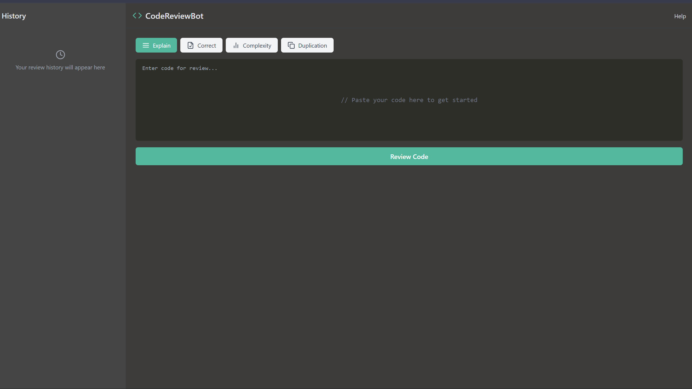
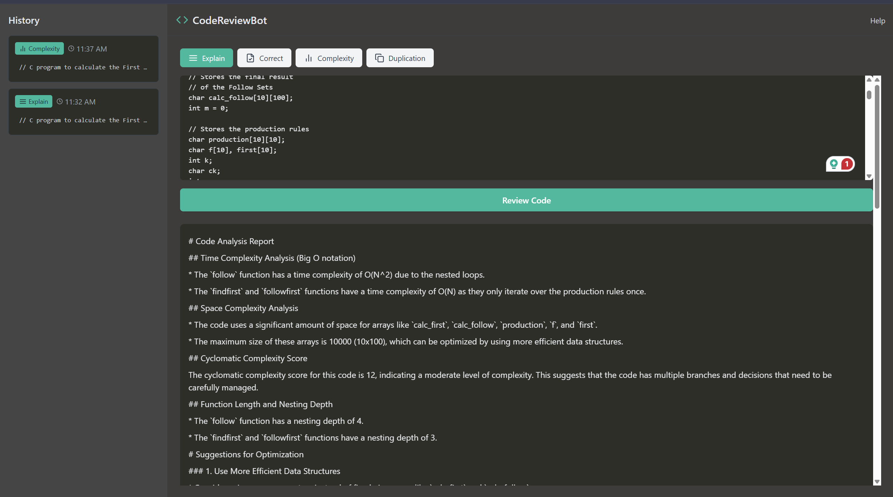
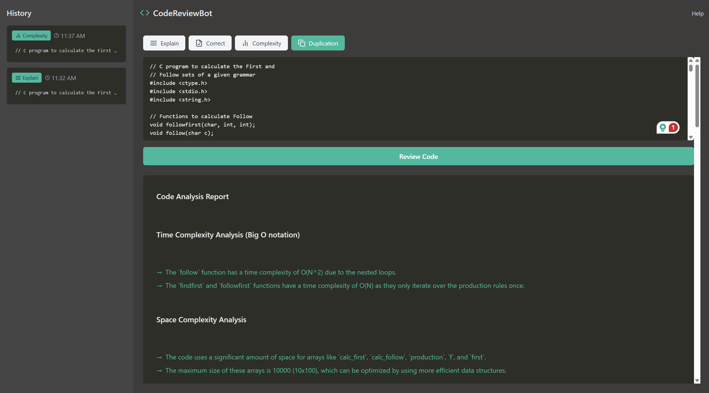
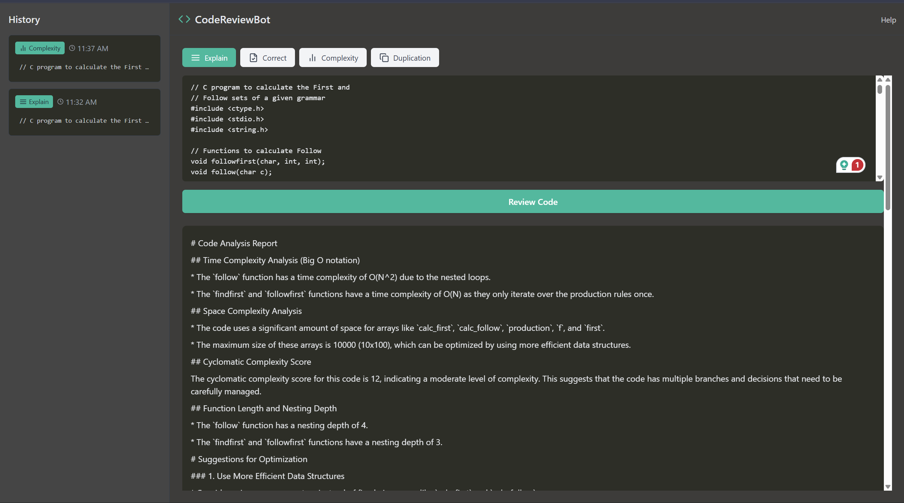

<div align="center">

#  CodeReviewBot

### AI-Powered Code Review Assistant — Fully Local, Fully Private

[](https://reactjs.org/)
[](https://www.typescriptlang.org/)
[](https://vitejs.dev/)
[](https://tailwindcss.com/)
[](https://fastapi.tiangolo.com/)
[](https://www.python.org/)
[](https://ollama.com/)
[](LICENSE)

**CodeReviewBot** is a full-stack AI code review tool that runs entirely on your local machine.  
Paste your code, choose a review mode, and get instant expert-level feedback — no API keys, no cloud, no data leaks.

[Features](#-features) · [Architecture](#-architecture) · [Installation](#-installation) · [Usage](#-usage) · [Roadmap](#-roadmap)

</div>

---

##  Screenshots

<div align="center">

| | |
|:---:|:---:|
|  |  |
|  |  |

</div>

---

##  Overview

CodeReviewBot leverages **Meta's LLaMA 3.2** (served locally via Ollama) to perform deep, contextual code analysis across multiple dimensions. Whether you want a plain-English explanation of complex logic or a thorough complexity audit, CodeReviewBot delivers structured, actionable feedback in seconds — GPU-accelerated on supported hardware (e.g. NVIDIA RTX 4070).

---

##  Features

| Feature | Description |
|---|---|
|  **Explain Mode** | Get a plain-English breakdown of what your code does |
|  **Correct Mode** | Identify bugs, anti-patterns, and receive corrected code |
|  **Complexity Mode** | Time & Space complexity analysis (Big-O notation) |
|  **Duplication Mode** | Detect repeated logic and refactoring opportunities |
|  **Cyclomatic Scoring** | Measures code path complexity with a numeric score |
|  **Optimization Hints** | Concrete suggestions to improve performance |
|  **Review History** | Timestamped log of all past reviews in the session |
|  **Dark Theme UI** | Clean, modern dark interface built with TailwindCSS |
|  **100% Local** | All inference runs on-device — your code never leaves your machine |

---

## Architecture

```
┌─────────────────────────────────────────────────────────────────┐
│                        USER BROWSER                             │
│                                                                 │
│   ┌─────────────────────────────────────────────────────────┐   │
│   │              React + Vite + TypeScript                  │   │
│   │                  TailwindCSS (Dark UI)                  │   │
│   │                                                         │   │
│   │   ┌────────────┐   ┌─────────────┐   ┌─────────────┐    │   │
│   │   │  Code      │   │   Review    │   │   History   │    │   │
│   │   │  Editor    │   │   Modes     │   │   Panel     │    │   │
│   │   └────────────┘   └─────────────┘   └─────────────┘    │   │
│   └──────────────────────────┬──────────────────────────────┘   │
│                              │  HTTP (REST)                     │
└──────────────────────────────┼──────────────────────────────────┘
                               │
                    ┌──────────▼──────────┐
                    │   FastAPI Backend   │
                    │     (Python)        │
                    │                     │
                    │  POST /review       │
                    │  GET  /history      │
                    │  GET  /health       │
                    └──────────┬──────────┘
                               │  HTTP (Ollama API)
                    ┌──────────▼──────────┐
                    │   Ollama Runtime    │
                    │                     │
                    │  Model: LLaMA 3.2   │
                    │  GPU: RTX 4070      │
                    │  Port: 11434        │
                    └─────────────────────┘
```

**Request Flow:**
```
User pastes code
      │
      ▼
React UI (selects mode) ──► FastAPI (/review) ──► Ollama API ──► LLaMA 3.2
                                                                      │
React UI (renders result) ◄── FastAPI (JSON) ◄── Ollama (stream) ◄───┘
      │
      ▼
Review saved to History Panel (with timestamp)
```

---

##  Project Structure

```
CodeReviewBot/
├── frontend/                   # React + Vite + TypeScript
│   ├── public/
│   ├── src/
│   │   ├── components/
│   │   │   ├── CodeEditor.tsx      # Code input area
│   │   │   ├── ReviewPanel.tsx     # AI output display
│   │   │   ├── ModeSelector.tsx    # Review mode buttons
│   │   │   ├── HistoryPanel.tsx    # Timestamped history log
│   │   │   └── Navbar.tsx
│   │   ├── hooks/
│   │   │   └── useReview.ts        # API call logic
│   │   ├── types/
│   │   │   └── index.ts
│   │   ├── App.tsx
│   │   └── main.tsx
│   ├── tailwind.config.ts
│   ├── vite.config.ts
│   └── package.json
│
├── backend/                    # FastAPI (Python)
│   ├── app/
│   │   ├── main.py                 # FastAPI app entry point
│   │   ├── routes/
│   │   │   └── review.py           # /review endpoint
│   │   ├── services/
│   │   │   └── ollama_service.py   # Ollama API wrapper
│   │   ├── models/
│   │   │   └── schemas.py          # Pydantic request/response models
│   │   └── prompts/
│   │       └── templates.py        # Mode-specific prompt templates
│   ├── requirements.txt
│   └── .env
│
├── .gitignore
├── LICENSE
└── README.md
```

---

## ⚙️ Installation

### Prerequisites

Ensure the following are installed on your Windows machine:

- [Node.js 18+](https://nodejs.org/) (includes npm)
- [Python 3.11+](https://www.python.org/downloads/)
- [Git](https://git-scm.com/)
- [Ollama](https://ollama.com/download) *(see step below)*
- NVIDIA GPU with up-to-date drivers *(optional but recommended)*

---

### Step 1 — Clone the Repository

```bash
git clone https://github.com/yourusername/CodeReviewBot.git
cd CodeReviewBot
```

---

### Step 2 — Install Ollama

1. Go to [https://ollama.com/download](https://ollama.com/download) and download the Windows installer.
2. Run the `.exe` and follow the setup wizard.
3. Verify installation by opening a terminal and running:

```bash
ollama --version
```

---

### Step 3 — Pull the LLaMA 3.2 Model

```bash
ollama pull llama3.2
```

> This downloads the model (~2GB). Ensure you have a stable internet connection.  
> GPU acceleration is automatic if a supported NVIDIA GPU is detected.

Verify the model is available:

```bash
ollama list
```

You should see `llama3.2` listed.

---

### Step 4 — Run the Backend

```bash
cd backend

# Create and activate virtual environment
python -m venv venv
venv\Scripts\activate

# Install dependencies
pip install -r requirements.txt

# Create environment file
copy .env.example .env

# Start the FastAPI server
uvicorn app.main:app --reload --port 8000
```

The backend will be live at: `http://localhost:8000`  
Interactive API docs: `http://localhost:8000/docs`

---

### Step 5 — Run the Frontend

Open a **new terminal window**:

```bash
cd frontend

# Install dependencies
npm install

# Start the development server
npm run dev
```

The app will be live at: `http://localhost:5173`

---

##  Usage

1. Open `http://localhost:5173` in your browser.
2. Paste your code into the editor panel.
3. Select a review mode:
   - **Explain** — Understand what the code does
   - **Correct** — Find and fix bugs
   - **Complexity** — Analyze Big-O time & space complexity
   - **Duplication** — Detect redundant logic
4. Click **"Review Code"** and wait for the AI response.
5. View your review history in the **History Panel** on the right.

---

##  API Reference

| Method | Endpoint | Description |
|---|---|---|
| `POST` | `/review` | Submit code for AI review |
| `GET` | `/history` | Retrieve session review history |
| `GET` | `/health` | Backend health check |

**Example Request:**
```json
POST /review
{
  "code": "def fibonacci(n):\n    if n <= 1: return n\n    return fibonacci(n-1) + fibonacci(n-2)",
  "mode": "complexity",
  "language": "python"
}
```

**Example Response:**
```json
{
  "review": "**Time Complexity:** O(2^n) — exponential due to overlapping subproblems...",
  "mode": "complexity",
  "timestamp": "2025-02-22T14:32:01Z",
  "cyclomatic_score": 3
}
```

---

##  Roadmap

- [ ] **Streaming responses** — Stream tokens from LLaMA for real-time output
- [ ] **Multi-file review** — Support uploading entire project folders
- [ ] **Language detection** — Auto-detect programming language
- [ ] **Export reports** — Download reviews as PDF or Markdown
- [ ] **GitHub integration** — Review PRs directly from a repo URL
- [ ] **Custom prompt templates** — Let users define their own review criteria
- [ ] **Model selector** — Switch between LLaMA 3.2, CodeLlama, Mistral, etc.
- [ ] **VS Code extension** — Trigger reviews from inside the editor
- [ ] **Persistent history** — Save reviews to a local SQLite database
- [ ] **Docker support** — One-command setup via `docker-compose up`

---

##  Tech Stack Summary

| Layer | Technology |
|---|---|
| Frontend | React 18, Vite 5, TypeScript 5, TailwindCSS 3 |
| Backend | FastAPI, Uvicorn, Python 3.11 |
| LLM Runtime | Ollama |
| AI Model | Meta LLaMA 3.2 |
| GPU Acceleration | NVIDIA RTX 4070 (CUDA) |
| Communication | REST API (JSON) |

---

##  License

This project is licensed under the **MIT License** — see the [LICENSE](LICENSE) file for details.

```
MIT License

Copyright (c) 2025 CodeReviewBot Contributors

Permission is hereby granted, free of charge, to any person obtaining a copy
of this software and associated documentation files (the "Software"), to deal
in the Software without restriction, including without limitation the rights
to use, copy, modify, merge, publish, distribute, sublicense, and/or sell
copies of the Software, and to permit persons to whom the Software is
furnished to do so, subject to the following conditions:

The above copyright notice and this permission notice shall be included in all
copies or substantial portions of the Software.
```

---

<div align="center">

Built with  using LLaMA 3.2, FastAPI, and React.  
**Star ⭐ this repo if you found it useful!**

</div>
